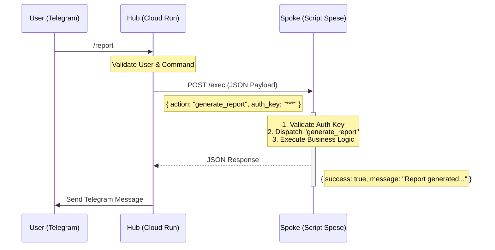
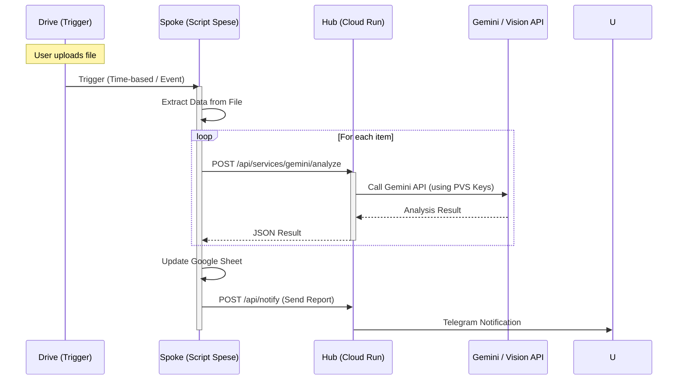

# System Overview & Architecture

This document provides a high-level view of the entire ecosystem, visualizing how the separate components (`Cloud Bot Controller`, `Script Spese`, `Personal Vision Services`) interact.

> **IMPORTANT**: Always update this document and the Mermaid diagrams below when architectural changes occur.

## 🌍 The "Hub-and-Spoke" Architecture

The system is composed of three distinct Google Cloud Projects (GCP) interacting via strict protocols.

```mermaid
graph TD
    User((User))
    
    subgraph "GCP: bot-orchestrator-hub"
        Hub[Bot Controller<br/>(Cloud Run / Python)]
        Secret[Secret Manager]
    end
    
    subgraph "GCP: YOUR_GCP_PROJECT_ID"
        AI_API[Gemini AI<br/>(API Provider)]
        Vision_API[Cloud Vision<br/>(API Provider)]
    end
    
    subgraph "Google Workspace"
        Spoke[Script Spese<br/>(Apps Script / TS)]
        Sheet[Google Sheets]
        Drive[Google Drive]
    end
    
    User -->|Telegram| Hub
    Hub -->|JSON Protocol| Spoke
    Spoke -->|Read/Write| Sheet
    Spoke -->|Read/Write| Drive
    
    %% AI interaction via Hub proxy
    Spoke -.->|Request AI| Hub
    Hub -.->|Proxy Request| AI_API
    Hub -.->|Proxy Request| Vision_API
    
    %% Secrets
    Secret -.->|Inject Secrets| Hub
```

## 🔄 End-to-End Flows

### 1. Standard Command Execution (e.g., `/report`)

This flow describes how a user command travels from Telegram to the Spoke and back.



### 2. Async Automation with AI (e.g., Expense Processing)

This flow shows how the Spoke uses the Hub as a proxy to access AI services (since API keys are centralized).



## 🔐 Security & Protocol

- **Authentication**: All calls from Hub to Spoke and Spoke to Hub must include the shared secret mechanism.
- **Protocol**: JSON payloads must adhere to the shared schema definitions (see `src/core/schemas.py` in Hub and `src/server/types/Protocol.ts` in Spoke).
